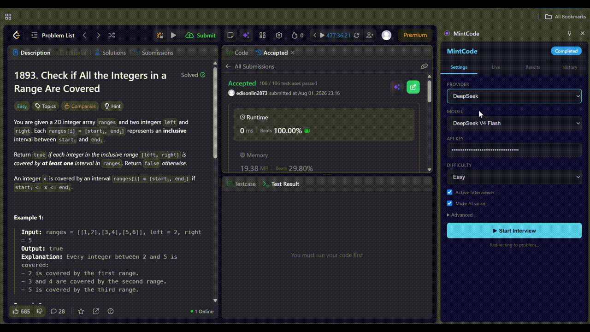

# MintCode


AI-powered mock interviews for LeetCode. MintCode runs a live coding interview in your browser: it picks a problem, acts as a technical interviewer, listens to your spoken explanations, watches your code, and grades the whole performance.

Built as a Chrome extension (Manifest V3). It uses **your own** LLM API key (BYOK) — nothing is routed through a MintCode server.

## Features

- **Random problem selection** — pulls the problem pool from [Zerotrac](https://zerotrac.github.io/leetcode_problem_rating/data.json) contest ratings and picks by difficulty (Random / Easy / Medium / Hard).
- **Realistic interview flow** — a countdown, a blurred problem statement, and a timer that matches the difficulty (20/30/45 min, or a custom override).
- **Active interviewer** — in Active mode the interviewer talks to you over TTS, reacts to your speech (STT), nudges you when you're silent, and gives SLIGHT hints on wrong answers. It ends the interview early when you get an **Accepted + optimal** solution.
- **Passive mode** — no questions, no hints. The interviewer stays silent and only grades your code and verbal explanation at the end.
- **Submission detection** — watches LeetCode verdicts (Accepted / Wrong Answer / TLE / MLE / errors).
- **Full evaluation** — scores five dimensions (problem understanding, communication, algorithmic thinking, code quality, speed), an overall score, a summary, and a Hire/No recommendation.
- **Code snapshots** — captures your code as it evolves (a bounded, evenly-sampled subset goes to the evaluation to keep token usage low).
- **Usage & cost tracking** — per-session and lifetime token/cost estimates.
- **Interview history** — completed interviews (score, dimensions, transcript, submissions, final code) are saved locally and can be exported to JSON.

## Requirements

- Google Chrome (Manifest V3).
- An API key for one of the supported providers (OpenAI, Anthropic, DeepSeek, OpenRouter, Groq, Google Gemini, xAI, Mistral, Together AI) — or any provider exposing an OpenAI-compatible `/chat/completions` endpoint.

## Installation

```bash
git clone https://github.com/edisonlin2873/mintcode.git
cd mintcode
npm install
npm run build
```

The build outputs to `dist/`. To load the extension:

1. Open `chrome://extensions`.
2. Enable **Developer mode** (top-right).
3. Click **Load unpacked** and select the `dist/` folder.

## Configuration

Open the extension side panel (click the extension icon) and configure:

- **Provider / Model** — pick from the built-in list; base URL and default model are filled in automatically.
- **API Key** — your provider key. It is stored in Chrome storage and sent only to the provider you configure; it is never sent to any MintCode server.
- **Difficulty** — Random / Easy / Medium / Hard.
- **Active Interviewer** — enables the live Q&A interviewer; leave off for passive grading-only mode.
- **Advanced** — duration override (minutes), custom input/output prices (USD per 1M tokens) if your provider's pricing differs from the table.

### Custom / OpenAI-compatible providers

For a provider not in the list, enter its OpenAI-compatible endpoint as the base URL. If the base URL already ends in `/chat/completions`, it is used as-is (e.g. Gemini: `https://generativelanguage.googleapis.com/v1beta/openai/chat/completions`). Anthropic-style APIs (`apiStyle: 'anthropic'`) are also supported.

## Usage

1. Configure provider, model, and API key in the side panel.
2. Click **Start Interview** — MintCode picks a problem, opens it on LeetCode, and starts the countdown.
3. Solve the problem while the interviewer listens; in Active mode it responds to your questions and verdicts.
4. Finish early, wait for the timer, or get an optimal Accepted submission to end the interview.
5. Review your evaluation on the Results tab and your past interviews on the History tab.

## Privacy & security

- Your API key is your own and is only sent to the provider you configure.
- Interview data (transcripts, code snapshots, evaluations) is stored locally in Chrome and never leaves your machine.
- AI output is HTML-escaped before rendering, and prompt content from the page/candidate is treated as untrusted data.

## Project structure

```
src/
  background/   Service worker: interview state machine, timer, AI client, evaluation
  content/      Content script + overlays on LeetCode: countdown, results, STT/TTS
  lib/          Storage, providers, messages, markdown, LeetCode API helpers
  page/         MAIN-world Monaco bridge for capturing editor code
  popup/        Popup UI
  sidepanel/    Side panel UI (settings, live, results, history)
  styles/       Overlay styles
```
